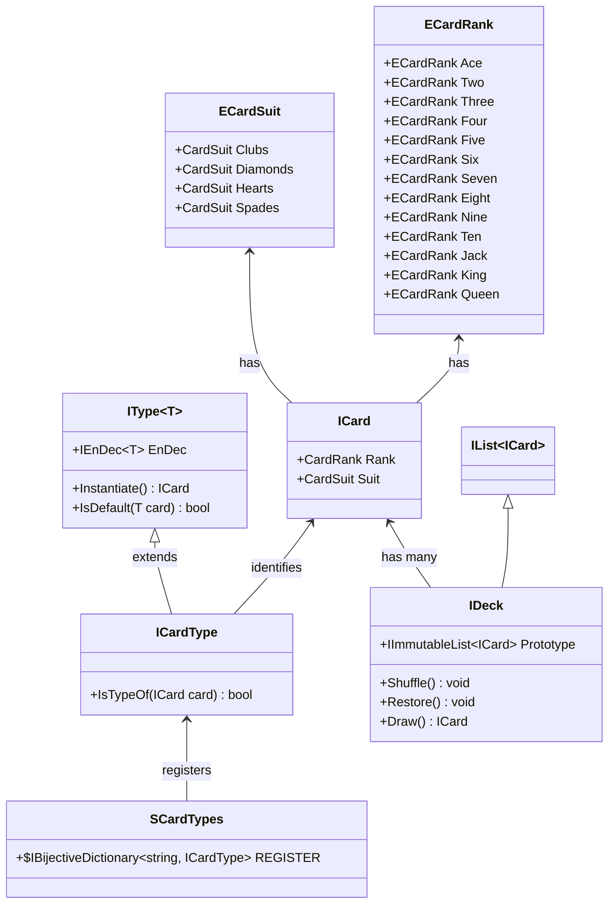
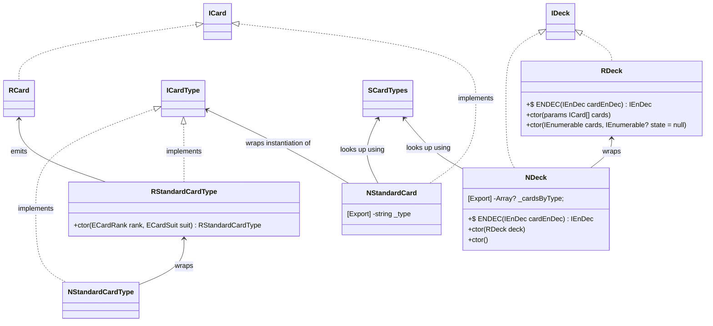

# Diagrams
## Contractual

```mermaid
classDiagram

    class ECardSuit{
        +CardSuit Clubs
        +CardSuit Diamonds
        +CardSuit Hearts
        +CardSuit Spades
    }

    class ECardRank{
        +ECardRank Ace
        +ECardRank Two
        +ECardRank Three
        +ECardRank Four
        +ECardRank Five
        +ECardRank Six
        +ECardRank Seven
        +ECardRank Eight
        +ECardRank Nine
        +ECardRank Ten
        +ECardRank Jack
        +ECardRank King
        +ECardRank Queen
    }

    class IType~T~{
        +IEnDec~T~ EnDec

        +Instantiate() ICard
        +IsDefault(T card) bool
    }

    class ICardType{
        +IsTypeOf(ICard card) bool
    }

    class ICard{
        +CardRank Rank
        +CardSuit Suit
    }

    class SCardTypes{
        +$IBijectiveDictionary~string, ICardType~ REGISTER
    }

    IType~ICard~ <|-- ICardType : extends
    ICardType <-- SCardTypes : registers

    ECardSuit <-- ICard : has
    ECardRank <-- ICard : has
    ICard <-- ICardType : identifies


    IList~ICard~ <|-- IDeck
    ICard <-- IDeck : has many

    class IDeck{
        +IImmutableList~ICard~ Prototype

        +Shuffle() void
        +Restore() void
        +Draw() ICard
    }


```

## Realized

```mermaid
classDiagram

    class NStandardCard{
        [Export] -string _type
    }

    RCard <-- RStandardCardType: emits

    class RStandardCardType{
        +ctor(ECardRank rank, ECardSuit suit) RStandardCardType
    }
    ICardType <-- NStandardCard : wraps instantiation of

    ICardType <|.. RStandardCardType : implements
    ICardType <|.. NStandardCardType : implements


    ICard <|.. NStandardCard : implements
        SCardTypes <-- NDeck : looks up using

    SCardTypes <-- NStandardCard : looks up using

    ICard <|.. RCard

    RStandardCardType <-- NStandardCardType : wraps


    class NDeck{
        +$ ENDEC(IEnDec<ICard> cardEnDec) IEnDec<NDeck>

        [Export] -Array<string>? _cardsByType;


        +ctor(RDeck deck)
        +ctor()
    }


    
    IDeck <|.. RDeck
    IDeck <|.. NDeck
    RDeck <-- NDeck : wraps


    class RDeck{
        +$ ENDEC(IEnDec<ICard> cardEnDec) IEnDec<RDeck>

        +ctor(params ICard[] cards)
        +ctor(IEnumerable<ICard> cards, IEnumerable<ICard>? state = null)
    }

   

```