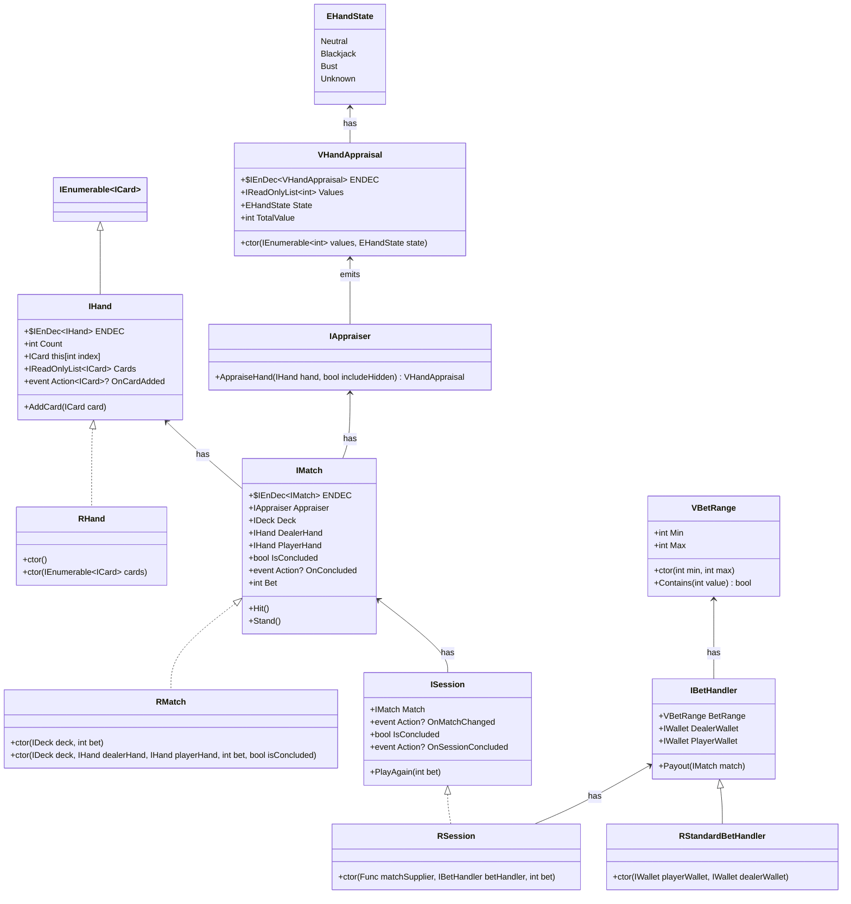
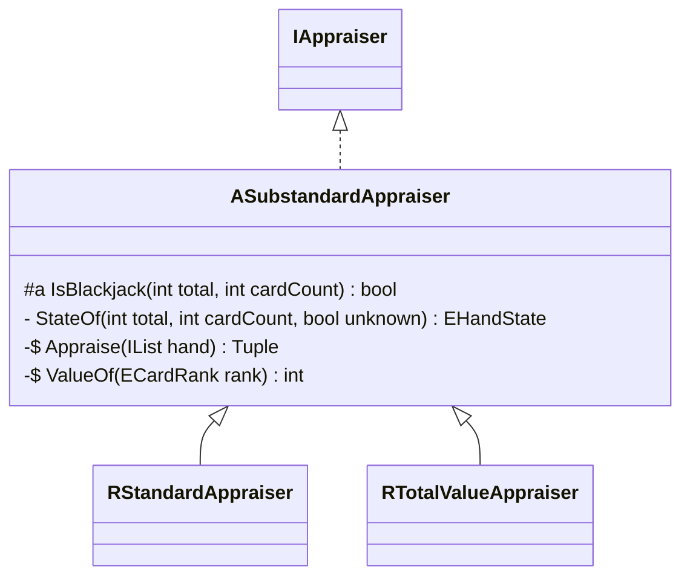

```mermaid
classDiagram
    IEnumerable~ICard~ <|-- IHand
    IHand <|.. RHand
    IMatch <|.. RMatch
    IHand <-- IMatch : has

    class IMatch{
        +$IEnDec~IMatch~ ENDEC

        +IAppraiser Appraiser
        +IDeck Deck
        +IHand DealerHand
        +IHand PlayerHand
        +bool IsConcluded
        +event Action? OnConcluded
        +int Bet

        +Hit()
        +Stand()
    }

    class RMatch{
        +ctor(IDeck deck, int bet)
        +ctor(IDeck deck, IHand dealerHand, IHand playerHand, int bet, bool isConcluded)
    }

    class IHand{
        +$IEnDec~IHand~ ENDEC

        +int Count
        +ICard this[int index]
        +IReadOnlyList~ICard~ Cards

        +event Action~ICard~? OnCardAdded
        +AddCard(ICard card)
    }

    class RHand{
        +ctor()
        +ctor(IEnumerable~ICard~ cards)
    }


    IAppraiser <-- IMatch : has
    EHandState <-- VHandAppraisal : has
    VHandAppraisal <-- IAppraiser : emits

    class EHandState{
        Neutral
        Blackjack
        Bust
        Unknown
    }

    class VHandAppraisal{
        +$IEnDec~VHandAppraisal~ ENDEC

        +IReadOnlyList~int~ Values
        +EHandState State
        +int TotalValue

        +ctor(IEnumerable~int~ values, EHandState state)
    }

    class IAppraiser{
        +AppraiseHand(IHand hand, bool includeHidden) VHandAppraisal
    }


    class VBetRange{
        +int Min
        +int Max

        +ctor(int min, int max)
        +Contains(int value) bool
    }

    VBetRange <-- IBetHandler : has

    class IBetHandler{
        +VBetRange BetRange
        +IWallet DealerWallet
        +IWallet PlayerWallet

        +Payout(IMatch match)
    }

    class RStandardBetHandler{
        +ctor(IWallet playerWallet, IWallet dealerWallet)
    }


    IMatch <-- ISession : has
    IBetHandler <-- RSession : has
    ISession <|.. RSession

    class ISession{
        +IMatch Match
        +event Action? OnMatchChanged
        +bool IsConcluded
        +event Action? OnSessionConcluded

        +PlayAgain(int bet)
    }

    class RSession{
        +ctor(Func<int, IMatch> matchSupplier, IBetHandler betHandler, int bet)
    }
    IBetHandler <|-- RStandardBetHandler

```

```mermaid
classDiagram
    IAppraiser <|.. ASubstandardAppraiser
    ASubstandardAppraiser <|-- RStandardAppraiser
    ASubstandardAppraiser <|-- RTotalValueAppraiser

    class ASubstandardAppraiser{
        #a  IsBlackjack(int total, int cardCount) bool
        - StateOf(int total, int cardCount, bool unknown) EHandState
        -$ Appraise(IList<ICard> hand) Tuple<int[], int>
        -$ ValueOf(ECardRank rank) int
    }
```