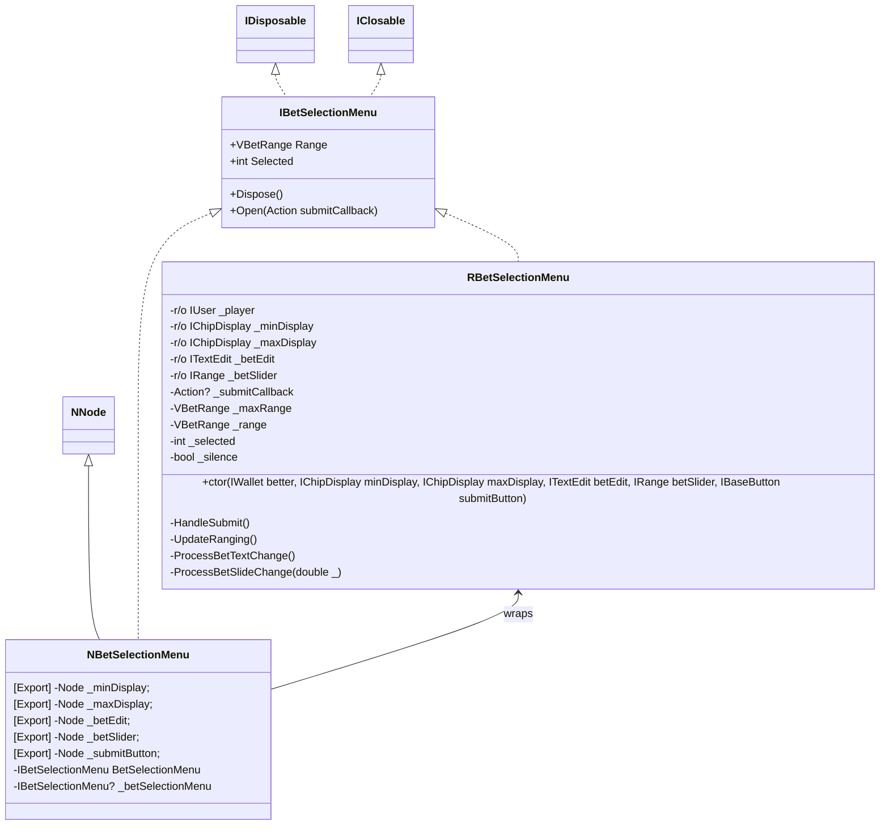

```mermaid
classDiagram
    NNode <|-- NBetSelectionMenu

    IDisposable <|.. IBetSelectionMenu
    IClosable <|.. IBetSelectionMenu
    IBetSelectionMenu <|.. RBetSelectionMenu
    IBetSelectionMenu <|.. NBetSelectionMenu
    RBetSelectionMenu <-- NBetSelectionMenu : wraps

    class IBetSelectionMenu{
        +VBetRange Range
        +int Selected
        +Dispose()
        +Open(Action<int> submitCallback)
    }

    class RBetSelectionMenu{
        -r/o IUser _player
        -r/o IChipDisplay _minDisplay
        -r/o IChipDisplay _maxDisplay
        -r/o ITextEdit _betEdit
        -r/o IRange _betSlider

        -Action<int>? _submitCallback
        -VBetRange _maxRange
        -VBetRange _range
        -int _selected
        -bool _silence

        +ctor(IWallet better, IChipDisplay minDisplay, IChipDisplay maxDisplay, ITextEdit betEdit, IRange betSlider, IBaseButton submitButton)

        -HandleSubmit()

        -UpdateRanging()
        -ProcessBetTextChange()
        -ProcessBetSlideChange(double _)
    }

    class NBetSelectionMenu{
        [Export] -Node _minDisplay;
        [Export] -Node _maxDisplay;
        [Export] -Node _betEdit;
        [Export] -Node _betSlider;
        [Export] -Node _submitButton;

        -IBetSelectionMenu BetSelectionMenu
        -IBetSelectionMenu? _betSelectionMenu
    }
```