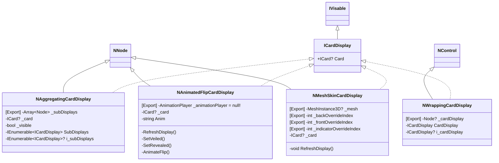

```mermaid
classDiagram
    IVisable <|-- ICardDisplay
    
    ICardDisplay <|.. NAggregatingCardDisplay
    NNode <|-- NAggregatingCardDisplay
    
    ICardDisplay <|.. NAnimatedFlipCardDisplay
    NNode <|-- NAnimatedFlipCardDisplay

    ICardDisplay <|.. NMeshSkinCardDisplay
    NNode <|-- NMeshSkinCardDisplay

    ICardDisplay <|.. NWrappingCardDisplay
    NControl <|-- NWrappingCardDisplay


    class ICardDisplay{
        +ICard? Card
    }

    class NAggregatingCardDisplay{
        [Export] -Array~Node~ _subDisplays
        -ICard? _card
        -bool _visible

        -IEnumerable~ICardDisplay~ SubDisplays
        -IEnumerable~ICardDisplay~? i_subDisplays
    }

    class NAnimatedFlipCardDisplay{
        [Export] -AnimationPlayer _animationPlayer = null!

        -ICard? _card
        -string Anim

        -RefreshDisplay()
        -SetVeiled()
        -SetRevealed()
        -AnimateFlip()
    }

    class NMeshSkinCardDisplay{
		[Export] -MeshInstance3D? _mesh
		[Export] -int _backOverrideIndex
		[Export] -int _frontOverrideIndex
		[Export] -int _indicatorOverrideIndex

		-ICard? _card

		-void RefreshDisplay()
	}

    class NWrappingCardDisplay{
		[Export] -Node? _cardDisplay

		-ICardDisplay CardDisplay
		-ICardDisplay? i_cardDisplay
	}
```