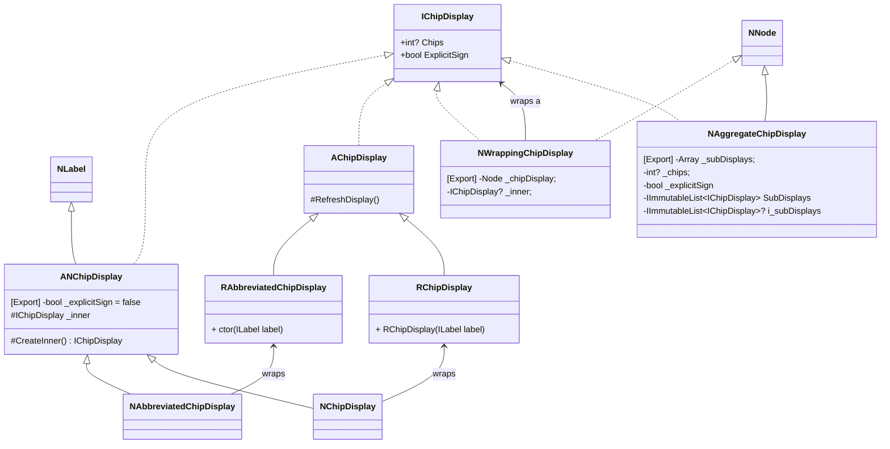

```mermaid
classDiagram

 

    IChipDisplay <|.. ANChipDisplay
    NLabel <|-- ANChipDisplay

    IChipDisplay <|.. AChipDisplay
    AChipDisplay <|-- RAbbreviatedChipDisplay
    AChipDisplay <|-- RChipDisplay

    ANChipDisplay <|-- NAbbreviatedChipDisplay 
    ANChipDisplay <|-- NChipDisplay

   IChipDisplay <|.. NWrappingChipDisplay
    IChipDisplay <-- NWrappingChipDisplay : wraps a
    NNode <|.. NWrappingChipDisplay


    RAbbreviatedChipDisplay <-- NAbbreviatedChipDisplay : wraps
    RChipDisplay <-- NChipDisplay : wraps


    IChipDisplay <|.. NAggregateChipDisplay
    NNode <|-- NAggregateChipDisplay

    class IChipDisplay{
        +int? Chips 
        +bool ExplicitSign
    }

    class AChipDisplay{
        #RefreshDisplay()
    }

    class ANChipDisplay{
        [Export] -bool _explicitSign = false

        #IChipDisplay _inner

        #CreateInner() IChipDisplay
    }


    class NWrappingChipDisplay{
		[Export] -Node _chipDisplay;
        
        -IChipDisplay? _inner;
    }

    class RAbbreviatedChipDisplay{
        + ctor(ILabel label)   
    }


    class RChipDisplay{
        + RChipDisplay(ILabel label)
    }


    class NAggregateChipDisplay {
        [Export] -Array<Node> _subDisplays;

        -int? _chips;
        -bool _explicitSign

        -IImmutableList~IChipDisplay~ SubDisplays
        -IImmutableList~IChipDisplay~? i_subDisplays
    }
```