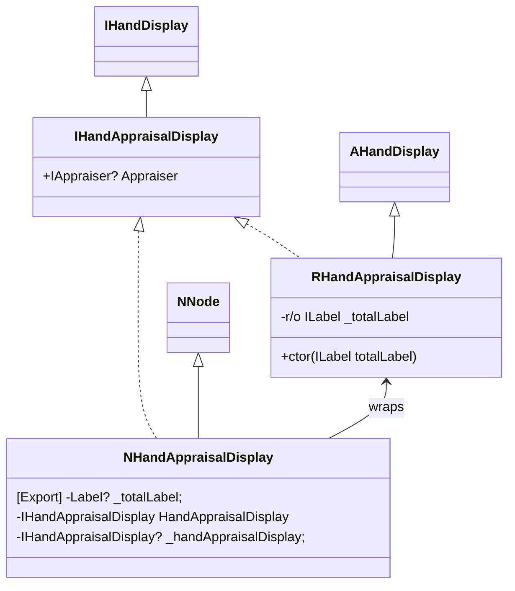

```mermaid
classDiagram
    IHandDisplay <|-- IHandAppraisalDisplay
    IHandAppraisalDisplay <|.. RHandAppraisalDisplay
    AHandDisplay <|-- RHandAppraisalDisplay
    IHandAppraisalDisplay <|.. NHandAppraisalDisplay
    NNode <|-- NHandAppraisalDisplay
    RHandAppraisalDisplay <-- NHandAppraisalDisplay : wraps


    class IHandAppraisalDisplay {
        +IAppraiser? Appraiser
    }

    class RHandAppraisalDisplay{
        -r/o ILabel _totalLabel

        +ctor(ILabel totalLabel)
    }

    class NHandAppraisalDisplay{
        [Export] -Label? _totalLabel;

        -IHandAppraisalDisplay HandAppraisalDisplay
        -IHandAppraisalDisplay? _handAppraisalDisplay;
    }
```