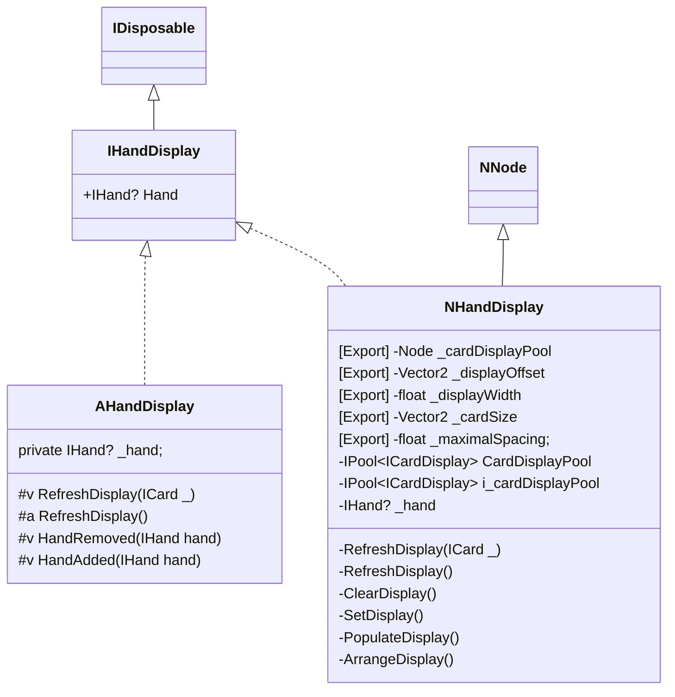

```mermaid
classDiagram
    IDisposable <|-- IHandDisplay
    IHandDisplay <|.. AHandDisplay
    IHandDisplay <|.. NHandDisplay
    NNode <|-- NHandDisplay
    


    class IHandDisplay{
        +IHand? Hand
    }

    class AHandDisplay{
        private IHand? _hand;

        #v RefreshDisplay(ICard _)
        #a RefreshDisplay()
        #v HandRemoved(IHand hand)
        #v HandAdded(IHand hand)
    }

    class NHandDisplay{
        [Export] -Node _cardDisplayPool
        [Export] -Vector2 _displayOffset
        [Export] -float _displayWidth
        [Export] -Vector2 _cardSize
        [Export] -float _maximalSpacing;

        -IPool~ICardDisplay~ CardDisplayPool
        -IPool~ICardDisplay~ i_cardDisplayPool 
        -IHand? _hand

        -RefreshDisplay(ICard _) 
        -RefreshDisplay()
        -ClearDisplay()
        -SetDisplay()
        -PopulateDisplay()
        -ArrangeDisplay()
    }
```