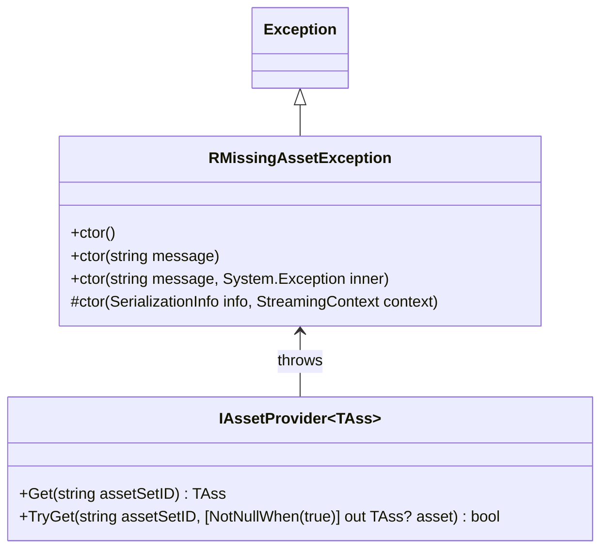

```mermaid
classDiagram
    Exception <|-- RMissingAssetException
    RMissingAssetException <-- IAssetProvider~TAss~ : throws

    class IAssetProvider~TAss~{
        +Get(string assetSetID) TAss
        +TryGet(string assetSetID, [NotNullWhen(true)] out TAss? asset) bool
    }

    class RMissingAssetException{
        +ctor()
        +ctor(string message)
        +ctor(string message, System.Exception inner)
        #ctor(SerializationInfo info, StreamingContext context)
    }
```