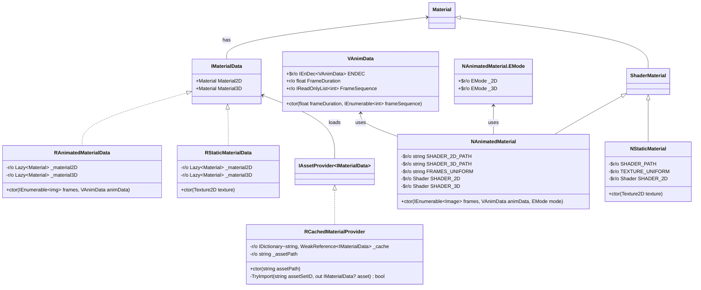

```mermaid
classDiagram

    
    Material <-- IMaterialData : has

    IMaterialData <|.. RAnimatedMaterialData
    IMaterialData <|.. RStaticMaterialData

    IMaterialData <-- IAssetProvider~IMaterialData~ : loads
    IAssetProvider~IMaterialData~ <|.. RCachedMaterialProvider

    Material <|-- ShaderMaterial
    ShaderMaterial <|-- NAnimatedMaterial
    ShaderMaterial <|-- NStaticMaterial

    NAnimatedMaterial.EMode <-- NAnimatedMaterial : uses
    VAnimData <-- NAnimatedMaterial : uses

    class IMaterialData{
        +Material Material2D
        +Material Material3D
    }

    class NAnimatedMaterial{
        -$r/o string SHADER_2D_PATH
        -$r/o string SHADER_3D_PATH
        -$r/o string FRAMES_UNIFORM
        
        -$r/o Shader SHADER_2D
        -$r/o Shader SHADER_3D

        +ctor(IEnumerable~Image~ frames, VAnimData animData, EMode mode)
    }

    class NAnimatedMaterial.EMode{
        +$r/o EMode _2D
        +$r/o EMode _3D
    }

    class NStaticMaterial{
        -$r/o SHADER_PATH
        -$r/o TEXTURE_UNIFORM

        -$r/o Shader SHADER_2D

        +ctor(Texture2D texture)
    }


    class RStaticMaterialData{
        -r/o Lazy~Material~ _material2D
        -r/o Lazy~Material~ _material3D

        +ctor(Texture2D texture)
    }

    class RAnimatedMaterialData{
        -r/o Lazy~Material~ _material2D
        -r/o Lazy~Material~ _material3D

        +ctor(IEnumerable<Image> frames, VAnimData animData)
    }


    class RCachedMaterialProvider{
        -r/o IDictionary~string, WeakReference~IMaterialData~ _cache
        -r/o string _assetPath

        +ctor(string assetPath)

        -TryImport(string assetSetID, out IMaterialData? asset) bool
    }

    class VAnimData{
        +$r/o IEnDec~VAnimData~ ENDEC

        +r/o float FrameDuration
        +r/o IReadOnlyList~int~ FrameSequence

        +ctor(float frameDuration, IEnumerable~int~ frameSequence)
    }
```