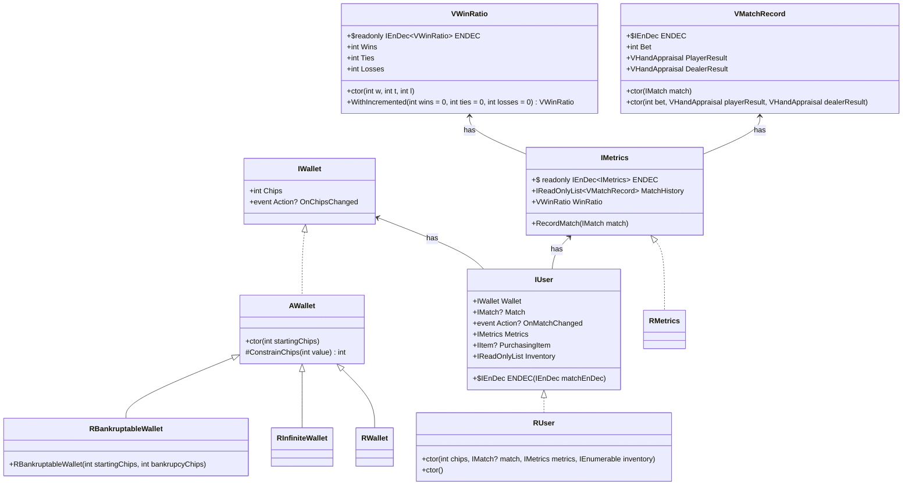

```mermaid
classDiagram

    IWallet <|.. AWallet
    AWallet <|-- RBankruptableWallet
    AWallet <|-- RInfiniteWallet
    AWallet <|-- RWallet

    class IWallet{
        +int Chips 
        +event Action? OnChipsChanged
    }

    class AWallet{
        +ctor(int startingChips)
        #ConstrainChips(int value) int
    }

    class RBankruptableWallet{
        +RBankruptableWallet(int startingChips, int bankrupcyChips)
    }


    VWinRatio <-- IMetrics : has
    VMatchRecord <-- IMetrics : has

    class VWinRatio{

        +$readonly IEnDec~VWinRatio~ ENDEC

        +int Wins
        +int Ties
        +int Losses
        
        +ctor(int w, int t, int l)

        +WithIncremented(int wins = 0, int ties = 0, int losses = 0) VWinRatio
    }

    class VMatchRecord{
        +$IEnDec<VMatchRecord> ENDEC

        +int Bet
        +VHandAppraisal PlayerResult
        +VHandAppraisal DealerResult

        +ctor(IMatch match)
        +ctor(int bet, VHandAppraisal playerResult, VHandAppraisal dealerResult)
    }

    class IMetrics{
        +$ readonly IEnDec~IMetrics~ ENDEC

        +IReadOnlyList~VMatchRecord~ MatchHistory
        +VWinRatio WinRatio

        +RecordMatch(IMatch match)
    }


    IWallet <-- IUser : has
    IMetrics <-- IUser : has

    IUser <|.. RUser

    class IUser{
        +$IEnDec<IUser> ENDEC(IEnDec<IMatch> matchEnDec)

        +IWallet Wallet

        +IMatch? Match
        +event Action? OnMatchChanged

        +IMetrics Metrics

        +IItem? PurchasingItem
        +IReadOnlyList<VItemRecord> Inventory
    }

    class RUser{
        +ctor(int chips, IMatch? match, IMetrics metrics, IEnumerable<VItemRecord> inventory)
        +ctor()
    }


    IMetrics <|.. RMetrics
```